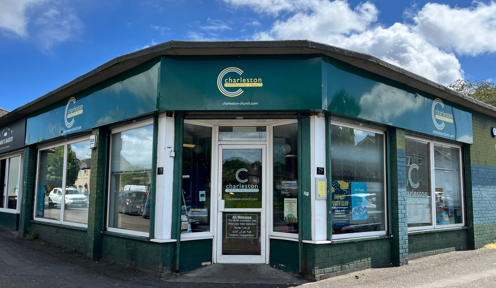

### The good news of Jesus knows no bounds, a message of love and redemption reaching out to all people regardless of their background or circumstances. 
We gather for [worship services](/whats-on/sunday-services/) every **Sunday at 10:30** in the [Charleston Community Centre](contact/#charleston-community-centre).  You are very welcome to join us and see how the message of the Bible brings hope and life to those who trust in Jesus.


## Charleston Community Church Vision

Our vision is to be a vibrant and transformative church, deeply rooted in the Word of God, passionately committed to honoring God, and centered on the person and work of Jesus Christ. We aspire to be a beacon of light, love, and hope in our community and beyond, impacting lives with the life-changing message of the Gospel.

Charleston Community Church is a family of Christian believers, united by our belief in Jesus Christ, the Son of God, who lived, died, and rose again, so that we, and anyone else who believes in him, can be reunited with our Heavenly Father.

Our hope is that everything we do is for God’s glory, not our own, as we seek to see Jesus known and praised across Dundee, Scotland, and the rest of the world. These beliefs and desires are underpinned by the Bible, the Word of God, which we hold as our highest authority. As individuals, and as a church family, we read it, learn from it and seek to apply it to our lives.

Continue reading in the <a href="about">About Us</a> section.

## What's on this Week:

    

        
Loading calendar events...

    

 

Read [today's daily bible passage](../about/daily-bible-reading). This collection of readings will help prepare you for Sunday's sermon and worship.

 





