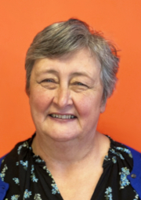
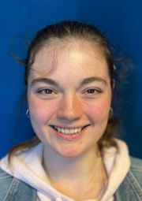

## Elders

The Bible teaches that churches should be led by elders. Charleston Community Church has three elders who provide overall leadership and serve in different ways through the life of the church.  
Andy Robertson, minister, is a teaching elder.

The elders exercise leadership in the church in a number of different ways. They meet together monthly as a group to pray for and decide on church matters. The different ministries throughout the church are 'elder-led' with specific elders appointed in an oversight capacity to each ministry.

    <figure class="flex flex-col items-center m-4 p-2 max-w-[90%]" style="margin-right: 13px;">
        
        <figcaption class="text-center" style="max-width: 140px; word-wrap: break-word;">
           <strong>Andy Robertson</strong> - Minister
        </figcaption>
    </figure>
    <figure class="flex flex-col items-center m-4 p-2 max-w-[90%]" style="margin-right: 8px;">
        
        <figcaption class="text-center">
            <strong>Phil Dickson</strong> - Elder
        </figcaption>
    </figure>
    <figure class="flex flex-col items-center m-4 p-2 max-w-[90%]" style="margin-left: 5px;">
        
        <figcaption class="text-center">
            <strong>Tim Allyn</strong> - Elder
        </figcaption>
    </figure>

### Staff Team
The staff team members are here with their roles.

    <figure class="flex flex-col items-center m-4 p-2 max-w-[100%]" style="margin-right: 40px; margin-left: 40px;">
        
        <figcaption class="text-center" style="max-width: 170px; word-wrap: break-word;">
            <strong>Chris Mina Morrison</strong> - Community and Family Support Worker
        </figcaption>
    </figure>
    <figure class="flex flex-col items-center m-4 p-2 max-w-[100%]" style="margin-right: 40px; margin-left: 40px;">
        
        <figcaption class="text-center" style="max-width: 150px; word-wrap: break-word;">
            <strong>Rachel Baker</strong> - Gospel Worker
        </figcaption>
    </figure>
    <figure class="flex flex-col items-center m-4 p-2 max-w-[100%]" style="margin-right: 40px; margin-left: 40px;">
        
        <figcaption class="text-center" style="max-width: 150px; word-wrap: break-word;">
            <strong>Bev Allyn</strong> - Administrator and Treasurer
        </figcaption>
    </figure>
      <figure class="flex flex-col items-center m-4 p-2 max-w-[100%]" style="margin-right: 40px; margin-left: 40px;">
        
        <figcaption class="text-center" style="max-width: 150px; word-wrap: break-word;">
            <strong>Kendra Sydserff</strong> - Church Intern
        </figcaption>
    </figure>

