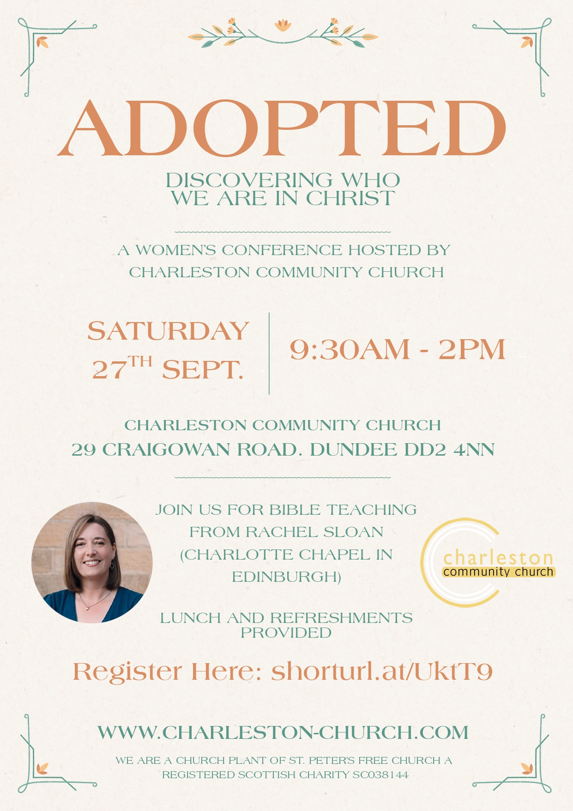

*A Women's Conference with the theme 'Discovering who we are in Christ'*

## Event Details

**Date:** Saturday, 27th September  
**Time:** 9:30 AM - 2:00 PM  
**Location:** Charleston Community Church  
**Address:** 29 Craigowan Road, Dundee DD2 4NN

## About the Conference

Join us for a special day of spiritual growth and fellowship as we explore what it means to be "Adopted" in Christ. This conference will help women discover their true identity in Jesus through:

- Bible teaching from Rachel Sloan (Charlotte Chapel, Edinburgh)
- Connection with other women
- Lunch and refreshments (provided)

## Featured Speaker: Rachel Sloan

[Rachel Sloan](https://fiec.org.uk/people/rachel-sloan) comes to us from Charlotte Chapel in Edinburgh, where she serves in women's ministry. She brings a wealth of biblical knowledge and practical wisdom to help women understand their identity in Christ.

Please [Register Now](https://docs.google.com/forms/d/e/1FAIpQLSc4h5e-E4HUvALf9b8m9boNnWF3u31rpnNpqpUcXLHdE2ddOg/viewform) to secure your spot!

## Venue Information

Charleston Community Church is located at 29 Craigowan Road, Dundee DD2 4NN. Parking is available on site, and the venue is accessible for those with mobility needs.

