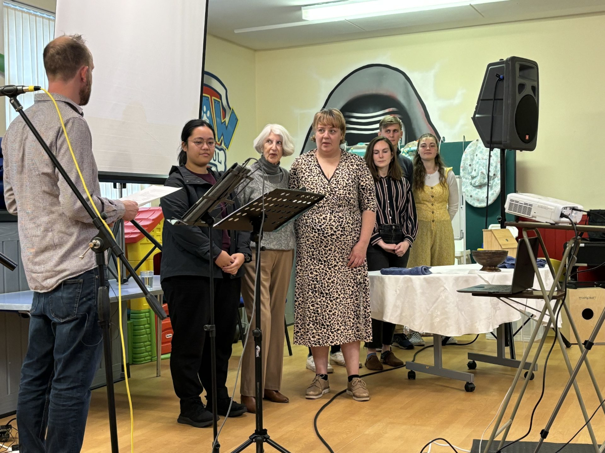
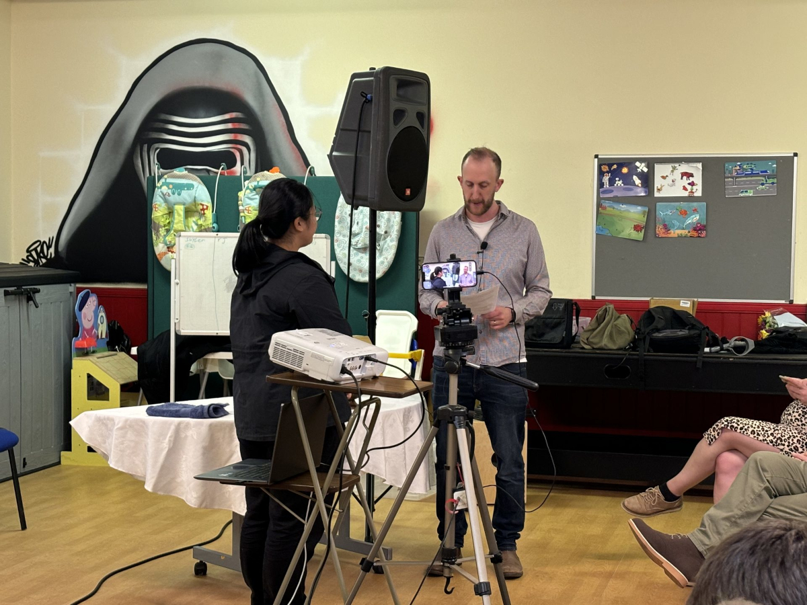
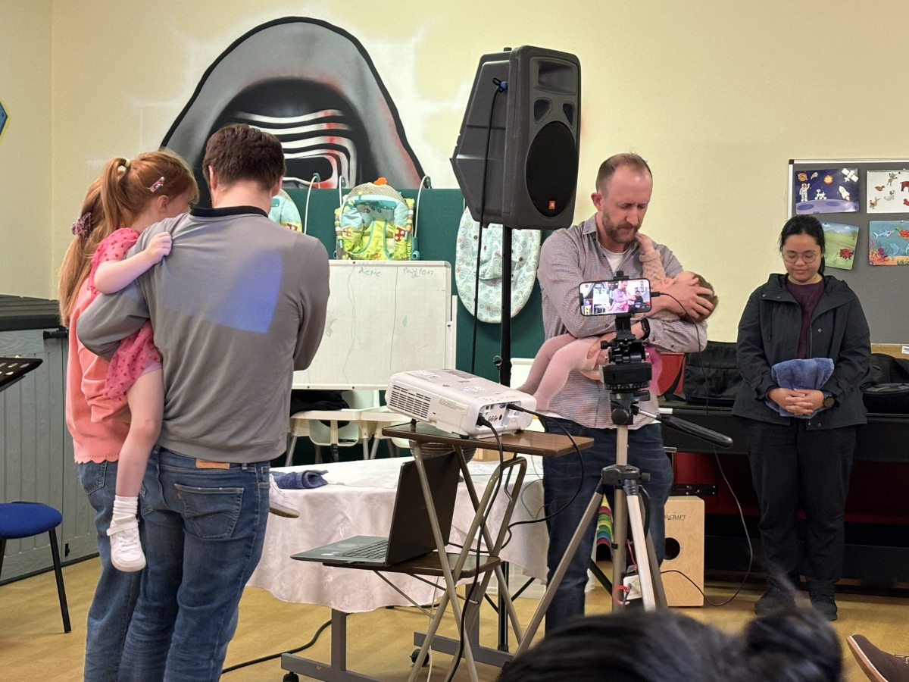
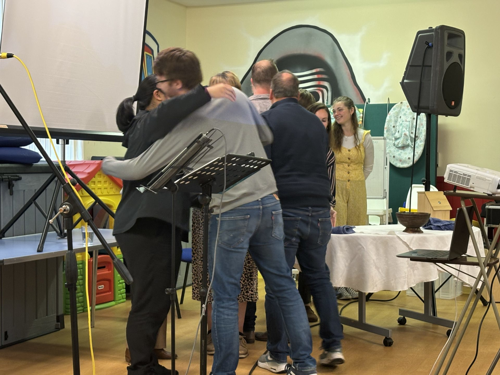

On the 22nd of September, Charleston Community Church welcomed eight new members, two of whom were also baptised (Iona and Stephanie)! The service was especially poignant for one of the newest members, Tammy, who had recently professed faith in Christ after being connected to the church since its launch in 2017.

Our minister, Rev. Andy Robertson, explained church membership during the service: “Church membership is not about receiving special privileges or rewards, like VIP treatment or loyalty benefits. Instead, it is a formal commitment made before God to the people of the church. It involves being dedicated to Jesus and to one another within the church community.”

Andy went on to explain that baptism symbolises the death of Jesus on the cross, which forgives sin and brings people into God’s family. “In the New Testament Church, baptism is a sign that points backward to what Jesus accomplished rather than forward to something still to come. The use of water in baptism represents the cleansing of sin and the union with Jesus that all Christians experience. Baptism is a picture of God’s promise to cleanse, save, and restore us to Him, but the act of baptism itself does not save. It’s not a magic ritual; there are baptised individuals who are not saved, and non-baptised individuals who are saved. Baptism is a sign, and signs point to what truly saves, which is living, saving faith in Jesus.”

Tim Allyn, an elder at Charleston, said, “It’s a testament to God’s faithfulness in building His church here in Charleston. We’ve been blessed to walk alongside these individuals as they’ve grown in their faith, and it’s a privilege to welcome them into our church family. We look forward to what God will continue to do in and through them.”

Following the service, the congregation gathered for lunch to celebrate the day. The sense of community was evident as the new members, the entire church family, and friends from further afield came together to mark the occasion.

