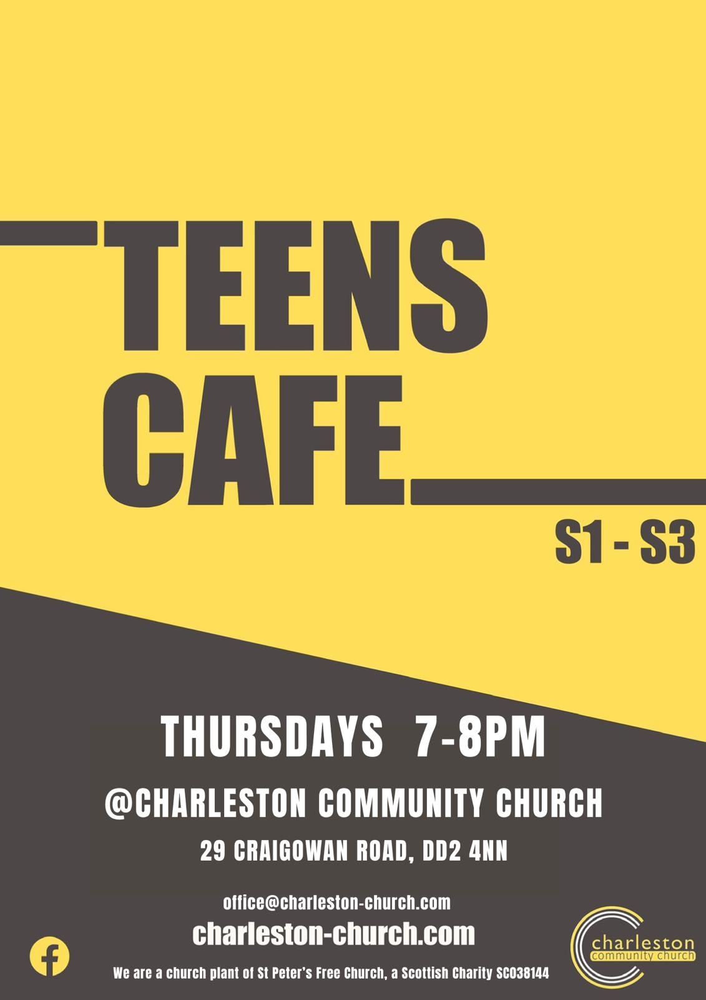
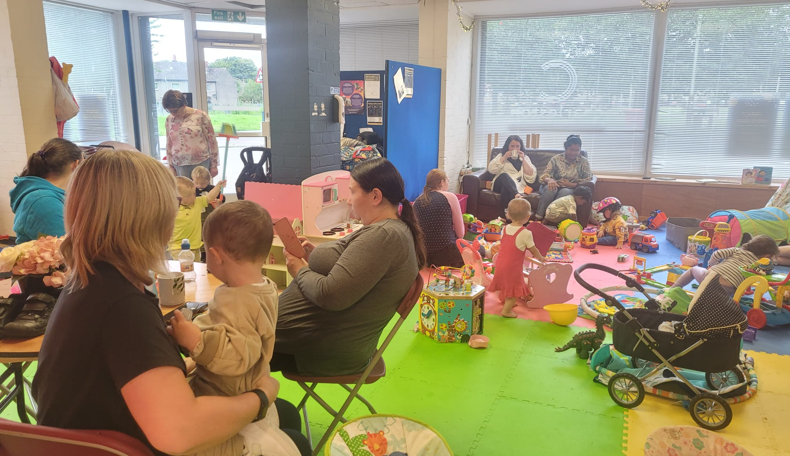
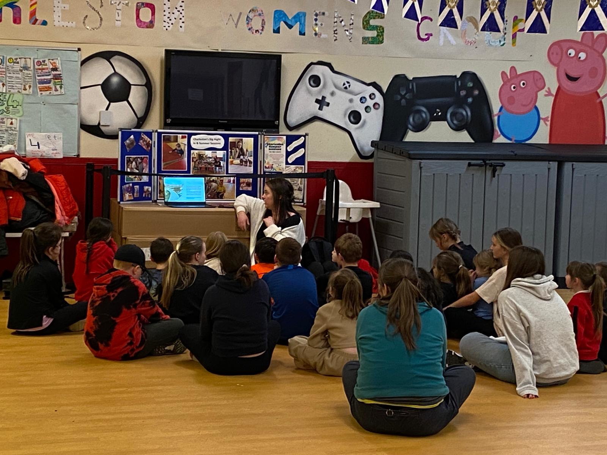
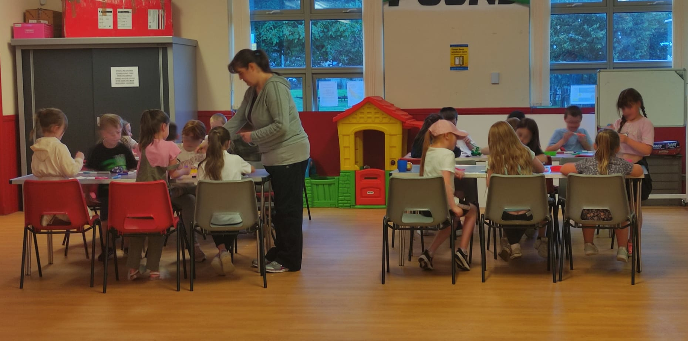

### Wee Rascals for Parents and Toddlers and Impact Club for Primary Age Youths and Teens Café Starts Back after the Summer Break.  NEW DAYS AND TIME apply to Impact Club (now on Tuesdays from 6 - 7pm) and Teens Café (now Thursdays at the usual time of 7 - 8pm).

Attention all young people, we hope you've had a great summer! But it's back to school and during term times we welcome you back to [Wee Rascals](/whats-on/childrens-activities/toddlers), [Impact Youth Club](/whats-on/childrens-activities/impact-youth-club) and [Teens Café](/whats-on/childrens-activities/teens-cafe). These child and youth events are places where friendships flourish, laughter lingers, and unforgettable memories are made.

**Wee Rascals will begin back the 17th of August 9:00 - 11:30** in the morning at the church and **Impact Youth Club will start back on TUESDAY the 24th August 6 - 7pm at the Community Centre. Please note the new day and time** You can [Pre-register your children to come on our Impact Club page here](/whats-on/childrens-activities/impact-youth-club) here or fill in the form at the door.  And **Teens Café will resume on THURSDAY the 26th August at 7pm. Please note the new day.**

Please visit our respective pages for more details on [Wee Rascals](/whats-on/childrens-activities/toddlers),  [Impact Youth Club](/whats-on/childrens-activities/impact-youth-club) and [Teens Café](/whats-on/childrens-activities/teens-cafe)

