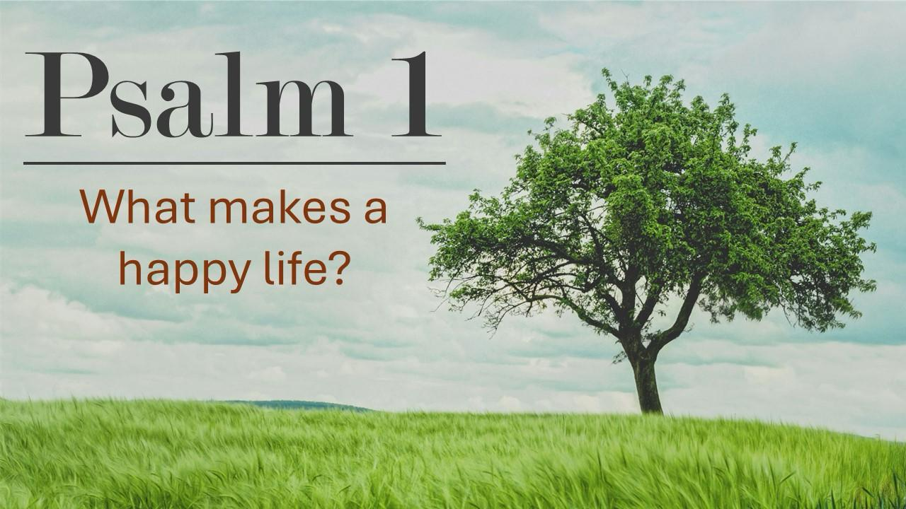
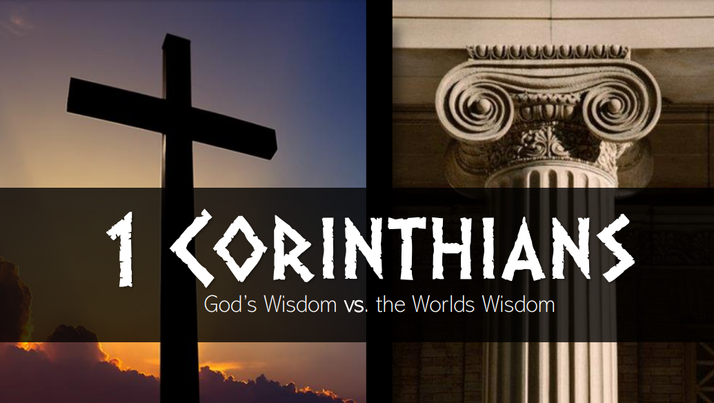

We invite you to join us in experiencing the life-transforming power of God's Word through our church sermons archive! And you are always welcome to worship with us in person every Sunday at 10:30 in the [Charleston Community Centre](../contact/#charleston-community-centre)

## Here is the latest sermon from our channel

## Current Sermon Series
  <!-- Psalms -->
## Sermon Archive ordered by Book of the Bible
 <!-- Exodus -->
 <!-- Judges -->
 <!-- Ruth -->
  <!-- Psalms -->
 <!-- Proverbs -->
 <!-- Ecclesiastes -->
 <!-- Ezekiel -->
 <!-- Daniel -->
 <!-- Jonah -->
 <!-- Habakkuk -->
 <!-- Matthew -->
 <!-- Mark -->
 <!-- Romans -->
 <!-- 1 Corinthians -->
 <!-- Philippians -->
 <!-- 1 Thessalonians -->
 <!-- 2 Thessalonians -->
 <!-- Philemon -->
## Other Sermons
 <!-- Carol Service -->
 <!-- Cross Crook and Crown -->
 <!-- Doctrine for the Scheme - Baptism -->
 <!-- Hope in Hard Times -->
 <!-- Sermon on the Mount -->
 <!-- Stand Alone -->

Stay up to date with all the latest Sermons on [Our Youtube Channel](https://www.youtube.com/channel/UC2SC7RXekX9eLkqmTsQy4SA).

<!--
Sermons from Matthew 26 - 28.

Sermons from the book of Psalms.

Sermons from the book of Romans.

Sermons from the book of Ezekiel.

Sermons from the book of Proverbs.

Sermons from the book of 1 Corinthians.

Sermons from the book of Daniel.

There are many other sermons and sermon series on [Our Youtube Channel](https://www.youtube.com/channel/UC2SC7RXekX9eLkqmTsQy4SA).  -->