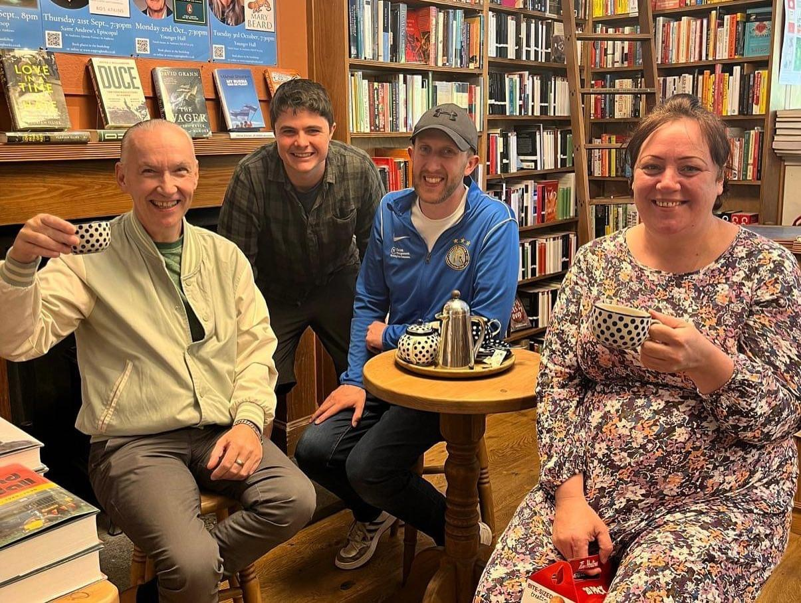

### We strive to be a church that radiates the love of Christ to all people, demonstrating compassion and extending grace to all regardless of their background.

At Charleston Community Church, we respond to God's boundless love by embracing our neighbors as ourselves. Join our community events—various youth activities, Senior's Lunch, Bible Studies, small groups and more—to deepen your faith, find encouragement, and experience genuine fellowship. Surround yourself with like-minded believers, fostering personal growth, accountability, and a deeper understanding of God's love. Live out your faith authentically, impacting the world through compassion, grace, and the transformative power of the gospel. 

Below is a brief table of our activities with more details listed at the bottom.

| **[Church Services](/whats-on/sunday-services)** | **Sunday 10:30am - noon** | **[Community Centre](../../../contact/#charleston-community-centre)** | 
| :----------------------: | :-----------: | :-----------: |
| Kids Church | Sunday 3 - 4pm | [Church](../../../contact/#charleston-community-church) | 
| **[Celebrate Recovery](/whats-on/celebrate-recovery/)** | **Sunday 4:30 - 5:45pm** | **[Church](../../../contact/#charleston-community-church)** | 
| [Craft and Cuppa](/whats-on/craft-and-cuppa) | Mon 10 - 12 | [Church](../../../contact/#charleston-community-church) | 
| **[Book Club](/whats-on/book-club)** | **1st Mon of month @ 5:30** | **[Community Centre](../../../contact/#charleston-community-centre)** | 
| [Drop In Café](/whats-on/cafes/cafe) | Tu: 10-1 / Fr: 12-2 | [Church](../../../contact/#charleston-community-church) | 
| **[Ladies' Bible Study](/whats-on/bible-studies/ladies-bible-study)** | **Tues 1-2pm** | **[Church](../../../contact/#charleston-community-church)** | 
| [Teen's Café](/whats-on/childrens-activities/teens-cafe) | Tues 7-8pm | [Church](../../../contact/#charleston-community-church) | 
| **[Senior's Lunch Club](/whats-on/seniors-lunch)** | **1st Wed of month @ 12:00** | **[Church](../../../contact/#charleston-community-church)** |
| [Home Bible Study](/whats-on/bible-studies/home-group-bible-study) | 2nd & 4th Wed 7-8pm | [Email to Register](../../../contact/#contact-form) | 
| **7 a-side football** | **Wed 9-10pm** | **[Change Centre](https://streetsoccerscotland.org/change-is-almost-here/)** | 
| [Wee Rascals](/whats-on/childrens-activities/toddlers) | Thurs 9-12 | [Church](../../../contact/#charleston-community-church) | 
| **[Impact Club](/whats-on/childrens-activities/impact-youth-club)** | **Thurs 7-8pm** | **[Community Centre](../../../contact/#charleston-community-centre)** | 
| Men's Prayer Breakfast | Last Sat of month 9-10:30 | [Church](../../../contact/#charleston-community-church) | 

#### Check out the finer details here:

