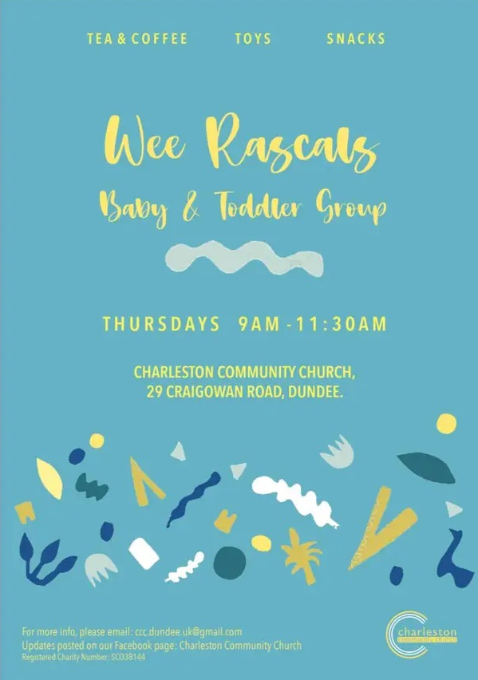
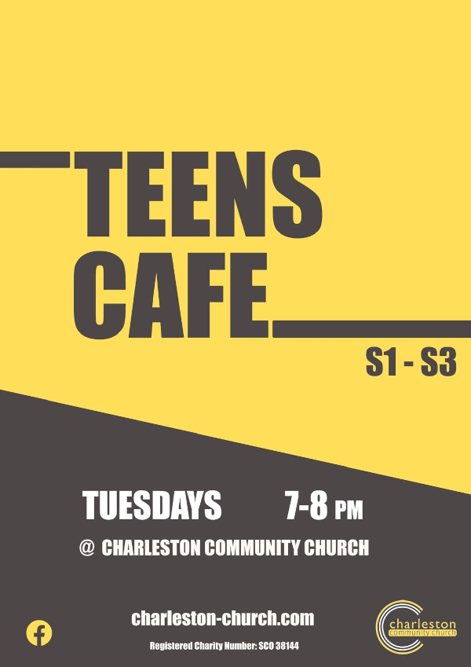

### Jesus said, “Let the little children come to me, and do not hinder them, for the kingdom of heaven belongs to such as these. -Matthew 19:14

 

This year's **Treasure Cove Holiday Club** is 30th June to 3rd July 2025. Check out all [the details here](../../../posts/holiday-club-2025/).





There are numerous activities for the kids from the regular groups like [Impact Youth Club](/whats-on/childrens-activities/impact-youth-club), [Teens Cafe](/whats-on/childrens-activities/teens-cafe) and [Wee Rascals Parent and Toddler group](/whats-on/childrens-activities/toddlers) to the [Holiday Clubs](../../posts/holiday-club) in the summer and Kid's Church each Sunday.

[Wee Rascals](/whats-on/childrens-activities/toddlers), [Teens Cafe](/whats-on/childrens-activities/teens-cafe) and [Impact Youth Club](/whats-on/childrens-activities/impact-youth-club) are places where friendships flourish, laughter lingers, and unforgettable memories are made. 
[**Wee Rascals is on Thursday's 9:00 - 11:30 during term times**](/whats-on/childrens-activities/toddlers) 

[**Impact Youth Club is on Thursday Evenings from 7 - 8pm at the Community Centre during term time.**](/whats-on/childrens-activities/impact-youth-club)

[**Teens Cafe is on Tuesday Evenings from 7 - 8pm at the Church during term time.**](/whats-on/childrens-activities/teens-cafe)

Please visit our respective pages for more details on [Wee Rascals](/whats-on/childrens-activities/toddlers) and  [Impact Youth Club](/whats-on/childrens-activities/impact-youth-club)

Follow our [Facebook Page](https://www.facebook.com/profile.php?id=100068696615791) or email us through our [Contact Page](../../../../contact/#contact-form) if you'd like more information on any of our Kid's programmes.

