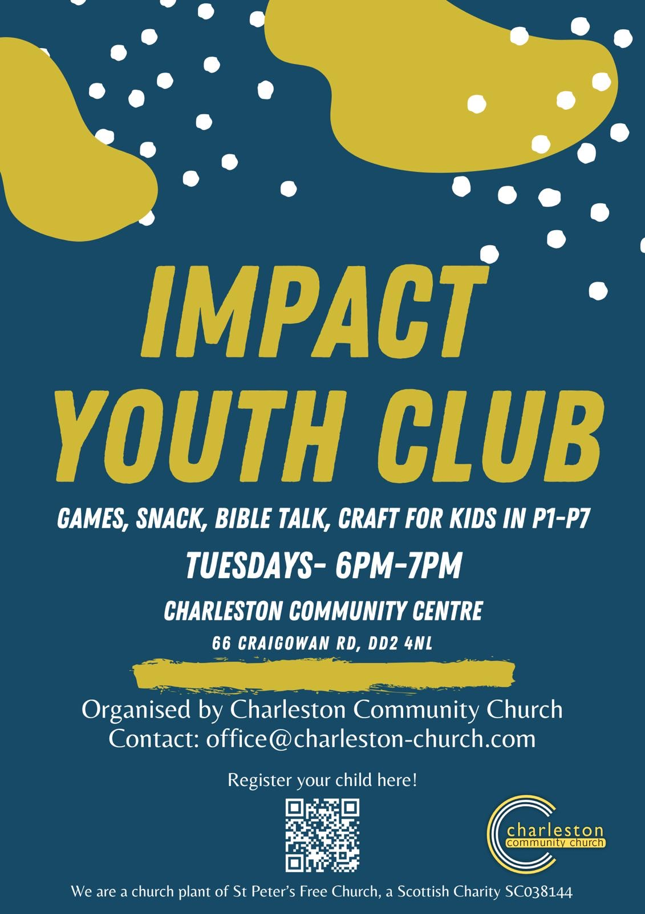
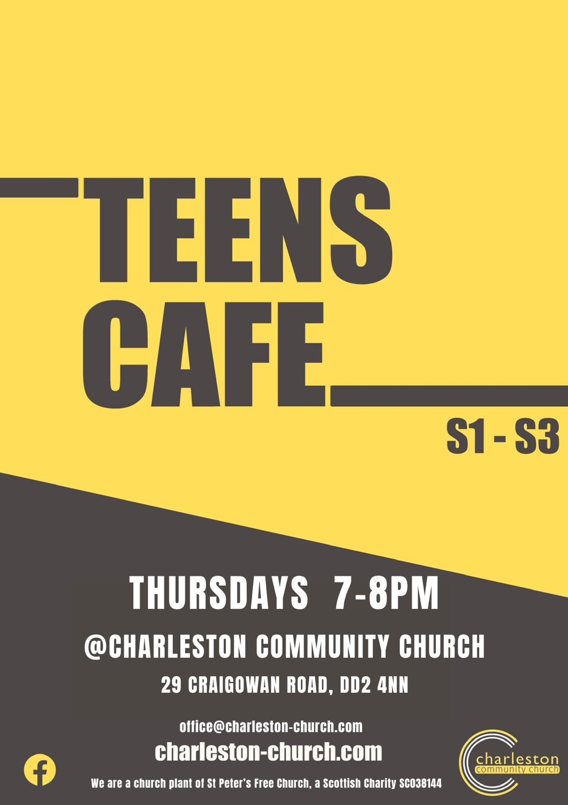

### Jesus said, “Let the little children come to me, and do not hinder them, for the kingdom of heaven belongs to such as these. -Matthew 19:14

There are numerous activities for the kids from the regular groups like [Impact Youth Club](/whats-on/childrens-activities/impact-youth-club), [Teens Café](/whats-on/childrens-activities/teens-cafe) and [Wee Rascals Parent and Toddler group](/whats-on/childrens-activities/toddlers) to the [Holiday Clubs](../../posts/holiday-club) in the summer and Kid's Church each Sunday.

[Wee Rascals](/whats-on/childrens-activities/toddlers), [Teens Café](/whats-on/childrens-activities/teens-cafe) and [Impact Youth Club](/whats-on/childrens-activities/impact-youth-club) are places where friendships flourish, laughter lingers, and unforgettable memories are made. 
[**Wee Rascals is on Thursday's 9:00 - 11:30 during term times**](/whats-on/childrens-activities/toddlers) 

[**Impact Youth Club is on Tuesday Evenings from 6 - 7pm at the Community Centre during term time.**](/whats-on/childrens-activities/impact-youth-club)

[**Teens Café is on Thursday Evenings from 7 - 8pm at the Church during term time.**](/whats-on/childrens-activities/teens-cafe)

Please visit our respective pages for more details on [Wee Rascals](/whats-on/childrens-activities/toddlers),  [Impact Youth Club](/whats-on/childrens-activities/impact-youth-club) and [Teens Café](/whats-on/childrens-activities/teens-cafe)

Follow our [Facebook Page](https://www.facebook.com/profile.php?id=100068696615791) or email us through our [Contact Page](../../../../contact/#contact-form) if you'd like more information on any of our Kid's programmes.

