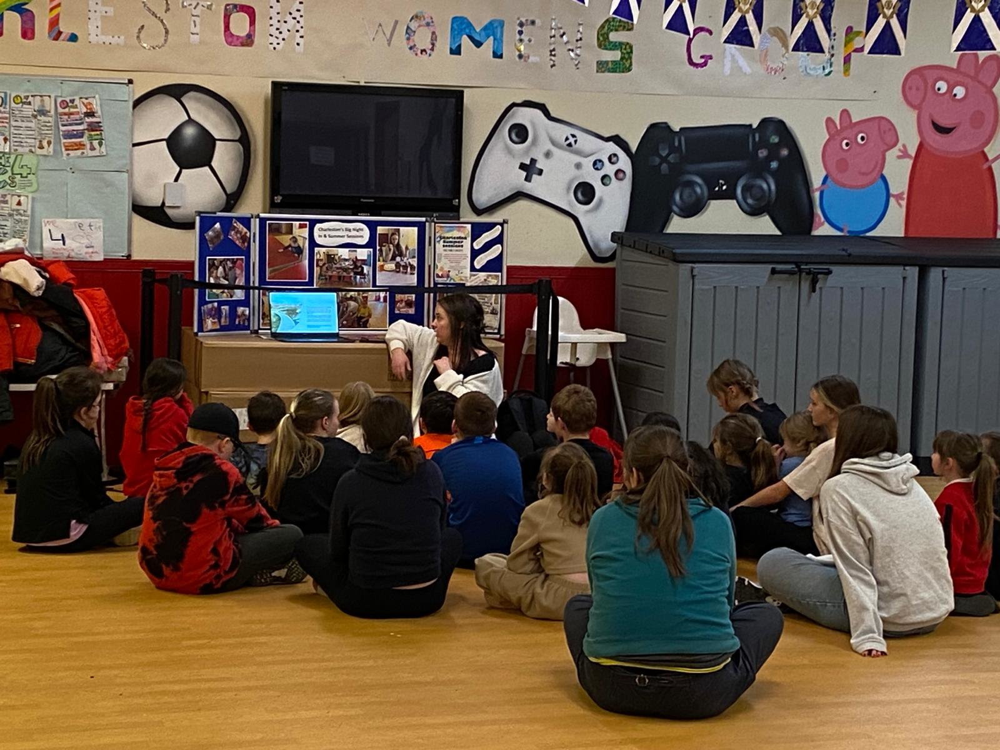
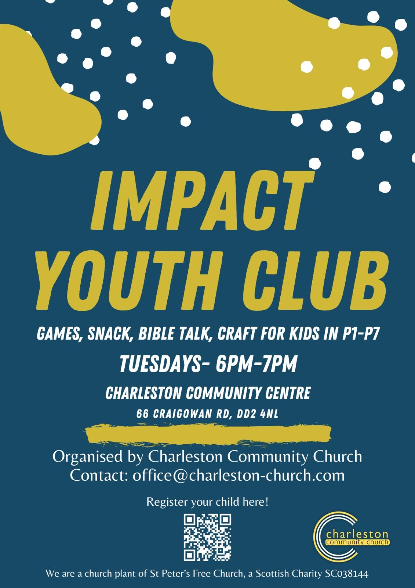

### Impact club is for all primary school students P1 - P7 during term time
🌟 Join Impact Youth Club: Fun, Friendship, and Faith! 🌟

Calling all primary school kids from P1 to P7! Join us on Tuesday nights during term time **from 6 to 7 pm at the [Charleston Community Centre](../../../contact/#charleston-community-centre)** for games, engaging bible lessons, crafts, and tasty snacks.

At Impact Club, kids experience the joy of building friendships, expressing creativity through crafts, active play and get complementary snacks ensuring a fun time for everyone. Our dedicated team of caring volunteers help every child feel welcomed and valued.  Parents/guardians must complete the registration form at the bottom of this page or on the door, and from then on, the kids can come and be part of Impact Club.  Our aim is to bless every young person by giving them a loving community and sharing the joy of knowing the God of the bible.

Details:  
📅 When: **Tuesday nights during term time**  
⌚ Time: **6:00 pm to 7:00 pm**  
📍 Location: **[Charleston Community Centre](../../../../contact/#charleston-community-centre)**, 66 Craigowan Road, Dundee  DD2 4NN

For more information, contact us through our [Contact Page](../../../../contact). We can't wait to welcome you to Impact Youth Club, where faith, friendship, and fun flourish!

Note: Parents or guardians are kindly requested to drop off and pick up their children at the designated times.

You can pre-register your child(ren) using the [Online Registration Form](https://docs.google.com/forms/d/e/1FAIpQLSf79gdV1t6oYG1GmD6KaLgDZl-pfIZzb72iWPB0MreqaTqTcQ/viewform). Fill in once for each child.

