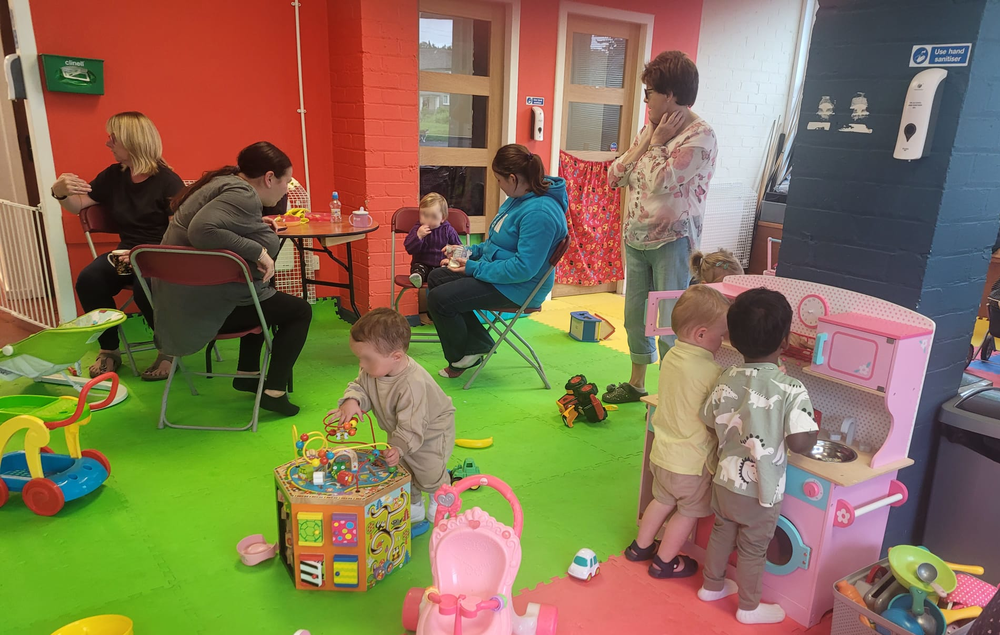

We are thrilled to extend a warm invitation to all parents/guardians and their adorable toddlers to join the Wee Rascals Baby and Toddler Group at Charleston Community Church. This playgroup takes place **every Thursday morning 9:00 to 11:30** during term time, providing a nurturing and engaging space for both children and parents alike. We welcome you to come and be a part of this wonderful community, where laughter, learning, and friendship abound.

**About Wee Rascals Group:**

Wee Rascals Group offers a supportive environment for parents and their little ones to connect, play, and grow together. The sessions are filled with engaging activities, including sensory play, arts and crafts, storytime adventures, and music, ensuring joyful discovery and development for your child(ren). 

The group emphasizes community and support for parents/guardians, providing a place to share life's struggles and build lasting friendships. Wee Rascals aims to create cherished memories and celebrate the joys of parenting while providing support during challenging times. All parents and their babies/toddlers are warmly invited to join this caring community for the support we all need in parenting.

